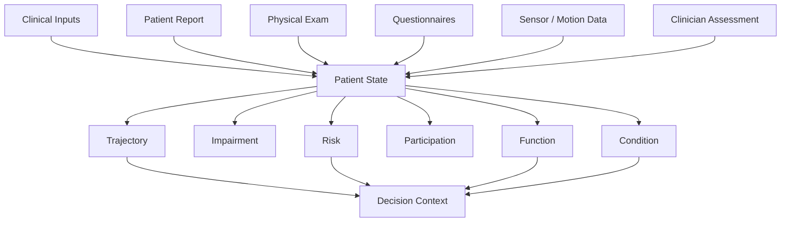

# Patient State System

Representing clinical reasoning as structured patient state for AI systems.

A public reference model for moving from note-centric workflows to explicit, decision-ready patient state.

## In One Sentence

This project explores how rehabilitation reasoning can be represented as structured state that is updateable over time, traceable to source inputs, and usable by software agents.

## Why This Exists

Most clinical workflows still collapse reasoning into free-text notes.
That makes it hard for software agents, decision support systems, and longitudinal care tools to understand what changed, why it changed, and what should happen next.

This repository explores a different approach:

> clinical reasoning is not only a note, it is a state

The goal is to model patient state as an explicit, updateable, decision-ready structure.

## Current Scope

- public reference model, not production software
- rehabilitation-oriented examples, but generalizable beyond one condition
- lightweight types and example data to make the concept concrete
- intentionally excludes PHI, operational workflows, auth, billing, and database internals

## What A Patient State System Does

- captures the current picture of the patient in a structured form
- separates key reasoning axes instead of flattening everything into one note
- preserves provenance so downstream systems know where each conclusion came from
- supports longitudinal updates over time
- makes state usable by AI systems without relying on fragile prompt-only context

## Core State Axes

This reference model uses six axes:

- `condition`: the current clinical problem framing
- `impairment`: measurable deficits, symptoms, and physical findings
- `function`: activity-level limitations and capabilities
- `participation`: work, sport, or life-role impact
- `risk`: red flags, yellow flags, barriers, and escalation signals
- `trajectory`: direction of change over time and response to care

## Reference Shape



## Repository Contents

- [`src/types/patient-state.ts`](./src/types/patient-state.ts): a minimal TypeScript reference model
- [`examples/patient-state.example.json`](./examples/patient-state.example.json): an example state snapshot
- [`docs/model-overview.md`](./docs/model-overview.md): model notes and design rationale

## Quick Glimpse

```ts
type PatientState = {
  patientId: string;
  axes: {
    condition: StateAxis;
    impairment: StateAxis;
    function: StateAxis;
    participation: StateAxis;
    risk: StateAxis;
    trajectory: StateAxis;
  };
  riskSignals: RiskSignal[];
  trajectory: TrajectorySnapshot;
};
```

## Design Principles

1. State over notes
Structured state should be primary. Narrative text can be derived from state, not the other way around.

2. Explicit provenance
Each meaningful conclusion should point back to its source.

3. Time matters
A useful patient model must represent change, not just a single snapshot.

4. Decision readiness
The shape should support triage, treatment planning, reassessment, and AI context assembly.

5. Partial updates
Clinical state changes incrementally. The model should tolerate incomplete but meaningful updates.

## Example Use Cases

- AI-assisted rehabilitation workflows
- longitudinal care tracking
- state-aware clinical documentation
- structured context assembly for agents
- outcome trend monitoring

## What This Repository Is Not

- not production clinical software
- not medical advice
- not a complete EMR schema
- not a replacement for clinician judgment

## Roadmap

- refine the reference state schema
- add update and transition examples
- map common rehabilitation assessments into state dimensions
- document how state feeds agent context and decision support
- publish comparison notes against note-centric workflows

## Status

Early public draft. The focus right now is clarity of model, not completeness of implementation.
